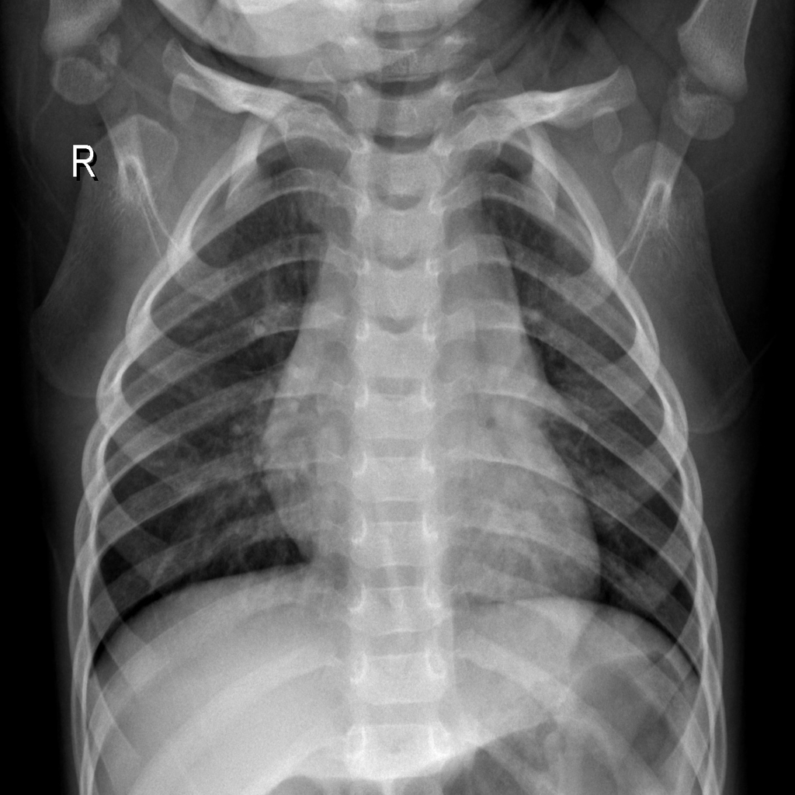
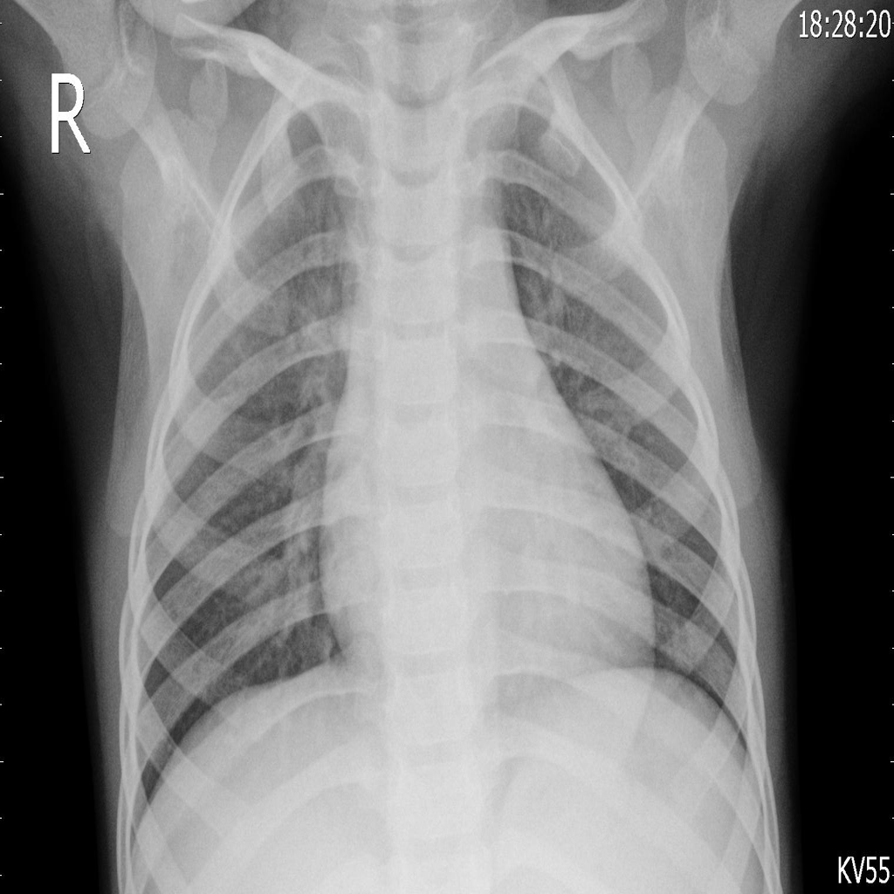
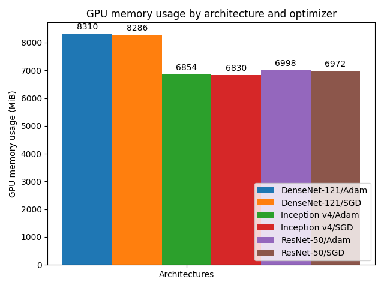
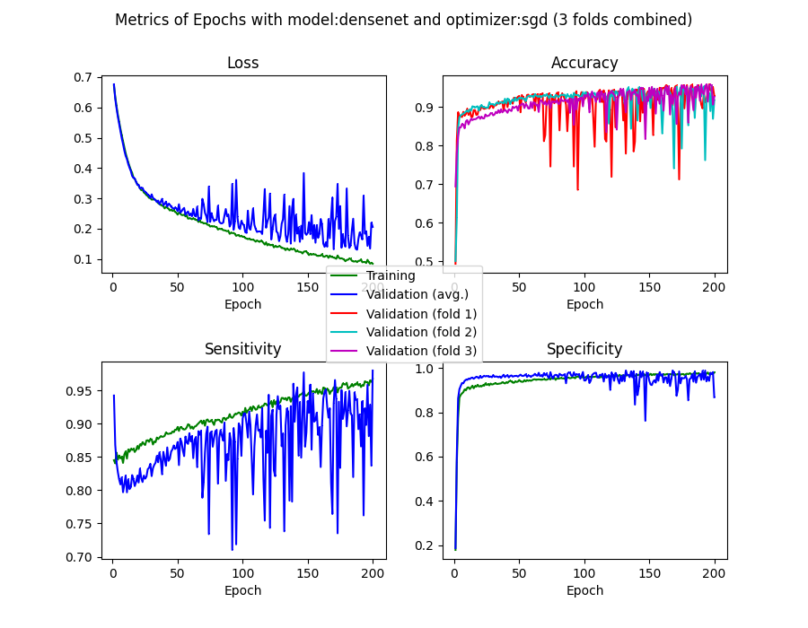
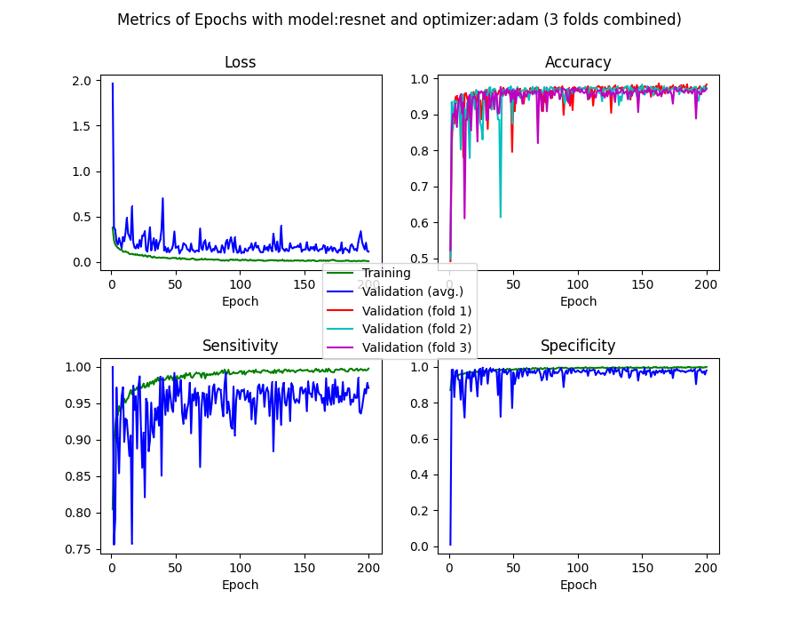
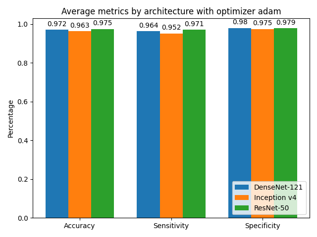
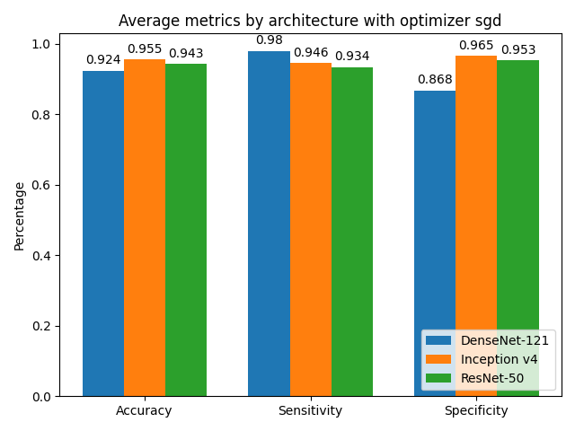
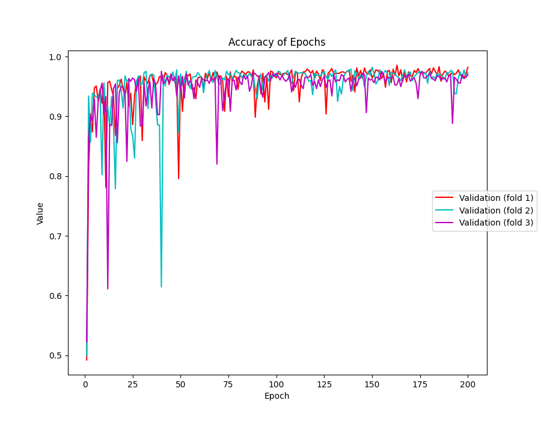

# BioMedProg SS2020
## Task: Medical Image Classification of Pneumonia

This project is a utilization of AI in medicine, aiming to implement medical image classification of Pneumonia. First we have a group of images of Thorax X-Ray Scans, which would be feeded to six different models that are composed of a neural network (DenseNet-121, Inception v4 or ResNet-50) and an optimizer (Adam or SGD), thus we could make a comparison of them and choose the best one as the final model to do further classification.

### Dataset
The given dataset has 2686 2D images of thorax X-Ray scans in total, each of which is labelled either normal (1341 x-rays) or viral pneumonia (1345 x-rays). Examples look like this (healthy thorax on the left, viral pneumonia on the right):




To enrich the dataset and improve the performance of model training and validation, we have done data augmentation (randomly rotate, flip and zoom) as well as resizing the images to 224 x 224 pixels (original size: 1024 x 1024 px).

The dataset can be downloaded in the [Megastore](https://megastore.uni-augsburg.de/get/ACRISBurPL/). Be aware that most of the images are actual gray scale PNG files (single color channel), but among them there are also RGB images with three color channels - which means you have to convert all files to single or three channel images during the preprocessing.

## Requirements & getting started
The GPU is required to have at least 7 GB available VRAM when using ResNet-50 or Inceptionv4, for DenseNet-50 you will need more than 8,3 GB.




At the very beginning, the recent [Python 3](https://www.python.org/) environment is needed to execute the project.
Before we can run the code we also need to install some required packages via the pip package manager:
```shell
$ pip install -r requirements.txt
```

We are using the PyTorch framework with the MONAI API.

To run the program, you can pass some arguments (this help can be shown by adding an "unknown" argument such as -h):
```shell
Usage of training.py:
    -m resnet|densenet|inceptionv4   Choose the model (default: resnet)
    -o adam|sgd                      Choose the optimizer (default: adam)
    -e N                             Number of epochs (default: 100)
    -i N                             Resize data images to N x N pixels (default: 224)
    -c N                             Number of cross validation folds - '0' means percentage split (default: 0 (percentage split))
 ```

If one of these switches is not passed explicitly, the according default value will be used (defaults are defined in `parameters.py` as well as the dataset path and other settings).

For example, you can run the training with ResNet-50, Adam optimizer, resize to 224 x 224 pixels and perform a 3-fold cross validation with 200 epochs each by executing
```shell
$ python3 training.py -m resnet -o adam -e 200 -i 224 -c 3
```

## Results

The program creates several plots during the execution in the `plots` directory. There is one plot for loss, accuracy, sensitivity and specificity for each fold, when running the k-fold cross validation. Another plot shows the same four metrics averaged over all folds. Two more plots show the usage of GPU memory during the exeuction. In case of cross validation, we also have the accuracy for all folds shown in an extra single plot. There is also one plot showing the metrics only of the last epoch run, as well as one plot of the average of all folds' last epochs.

Additionally, the complete log of the execution can be found in `logs`.

Example metrics of the combination of model and optimizer, shown are DenseNet-121 with SGD and ResNet-50 with Adam:

 

The performance of all different architectures with Adam and SGD optimizer compared (results of the last epoch):

 

We found that DenseNet-121 with SGD is beginning to overfit after 75 epochs. ResNet-50 with SGD is overfitting after around 150 epochs. This does not apply to Inceptionv4, yet Adam is performing better. It turned out that ResNet-50 with Adam optimizer leads to the most stable results. Over all three architectures the Adam optimizer has been outperforming SGD for the present dataset. ResNet-50 has been the most stable architecture on the long run, also providing the best performance in the last epoch. Its accuracy in a single plot:




## Authors

Brain, Fabian

Chang, Qiang